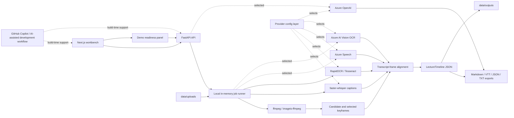

# Architecture

AccessiNote currently runs as a local two-process app:

- `backend/`: FastAPI API with Pydantic models and local JSON storage.
- `frontend/`: Next.js App Router UI for loading timelines, creating transcript timelines, and rendering generated markdown.
- `data/samples/`: synthetic demo lecture timeline.
- `data/outputs/`: ignored local generated timelines.
- `data/uploads/`: reserved ignored local upload folder.

For the Agents League Creative Apps track, the submission story should also describe the AI-assisted
development workflow used to build and polish the application. If GitHub Copilot was used by the
team, name it in the submission form and demo narration; do not claim Copilot usage unless it is
accurate for the final submitted work.

The backend exposes:

- `GET /health`
- `GET /api/lectures/sample`
- `GET /api/lectures`
- `POST /api/lectures`
- `GET /api/lectures/{lecture_id}`
- `POST /api/lectures/{lecture_id}/generate`
- `GET /api/capabilities` with local tool readiness and optional provider metadata
- `GET /api/demo/status`
- `POST /api/jobs/media`
- `GET /api/jobs?active=true`
- `GET /api/jobs/{job_id}`
- `POST /api/jobs/{job_id}/cancel`
- `POST /api/videos/upload`
- `POST /api/images/upload`
- `GET /api/lectures/{lecture_id}/frames/{filename}`

Generation defaults to deterministic local output and can use Azure OpenAI when selected. Video upload uses local tooling with optional Azure providers:

- System `ffmpeg` or the Python `imageio-ffmpeg` fallback extracts selected keyframes from the uploaded video.
- RapidOCR scans original and preprocessed keyframe variants locally when available; Tesseract OCR can be used as a fallback.
- Optional `.txt`, `.srt`, or `.vtt` caption files are parsed and merged into the video timeline.
- When no caption/transcript file is supplied, faster-whisper can generate local timed captions from the video audio.
- Frame selection starts at `0s` and combines early coverage, scene-change detection, transcript keyword points, transcript coverage points, and periodic visual coverage instead of a fixed 30-second stride.
- The default frame selection budget is 72 timestamps and can be tuned with `ACCESSINOTE_MAX_VIDEO_FRAMES`.
- Generated or uploaded caption segments are stored on the local timeline as `caption_segments` and can be exported as WebVTT.
- Timeline JSON includes `processing_metadata` with stages, providers, metrics, warnings, and per-frame evidence.
- If video frames cannot be extracted, the backend returns a fallback timeline with explicit warnings.
- Recent local timelines are listed by reading JSON files in `data/outputs`; no database is used.
- Demo readiness checks sample data, local output storage, ffmpeg, OCR, transcription, exports, recent video processing, and optional Microsoft provider configuration.

No auth, database, or Azure storage is required for the hackathon demo. The app can run with local
fallbacks, or it can use Azure providers when selected through environment variables. For a public
production demo, host the Next.js frontend on Vercel and the FastAPI media backend on Azure Container
Apps or Azure App Service for Containers. A longer-lived public product should move uploads and
outputs from local JSON files to durable Azure storage.

## Local Pipeline

## Provider Seams

`backend/app/providers.py` defines provider protocols for transcription, OCR, visual understanding,
and generation. The current app defaults to local deterministic implementations; Azure providers are
selected only when the corresponding environment variables are set.

Optional provider environment switches:

- `TRANSCRIPTION_PROVIDER=local|azure_speech`
- `OCR_PROVIDER=local|azure_vision`
- `GENERATION_PROVIDER=local|azure_openai`

`/api/capabilities` returns provider metadata for `transcription`, `ocr`, and `generation`, including
the selected provider name, whether it is configured, and which environment variables are required
for Azure-backed implementations. Missing Azure keys are warnings for submission readiness, not
blockers for the local demo.

Azure provider behavior:

- `azure_speech`: transcribes extracted video audio through Azure Speech, then falls back to
  faster-whisper if the cloud call fails.
- `azure_vision`: scans uploaded images and selected video frames through Azure AI Vision Read OCR,
  then falls back to RapidOCR/Tesseract when needed.
- `azure_openai`: rewrites timeline evidence into accessible Markdown outputs, then falls back to the
  deterministic local generator if generation fails.
