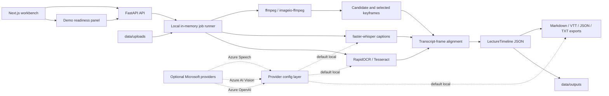

# Architecture

AccessiNote currently runs as a local two-process app:

- `backend/`: FastAPI API with Pydantic models and local JSON storage.
- `frontend/`: Next.js App Router UI for loading timelines, creating transcript timelines, and rendering generated markdown.
- `data/samples/`: synthetic demo lecture timeline.
- `data/outputs/`: ignored local generated timelines.
- `data/uploads/`: reserved ignored local upload folder.

The backend exposes:

- `GET /health`
- `GET /api/lectures/sample`
- `GET /api/lectures`
- `POST /api/lectures`
- `GET /api/lectures/{lecture_id}`
- `POST /api/lectures/{lecture_id}/generate`
- `GET /api/capabilities` with local tool readiness and optional provider metadata
- `GET /api/demo/status`
- `POST /api/jobs/media`
- `GET /api/jobs?active=true`
- `GET /api/jobs/{job_id}`
- `POST /api/jobs/{job_id}/cancel`
- `POST /api/videos/upload`
- `POST /api/images/upload`
- `GET /api/lectures/{lecture_id}/frames/{filename}`

Generation is deterministic and local. Video upload uses local tooling only:

- System `ffmpeg` or the Python `imageio-ffmpeg` fallback extracts selected keyframes from the uploaded video.
- RapidOCR scans original and preprocessed keyframe variants locally when available; Tesseract OCR can be used as a fallback.
- Optional `.txt`, `.srt`, or `.vtt` caption files are parsed and merged into the video timeline.
- When no caption/transcript file is supplied, faster-whisper can generate local timed captions from the video audio.
- Frame selection starts at `0s` and combines early coverage, scene-change detection, transcript keyword points, transcript coverage points, and periodic visual coverage instead of a fixed 30-second stride.
- The default frame selection budget is 72 timestamps and can be tuned with `ACCESSINOTE_MAX_VIDEO_FRAMES`.
- Generated or uploaded caption segments are stored on the local timeline as `caption_segments` and can be exported as WebVTT.
- Timeline JSON includes `processing_metadata` with stages, providers, metrics, warnings, and per-frame evidence.
- If video frames cannot be extracted, the backend returns a fallback timeline with explicit warnings.
- Recent local timelines are listed by reading JSON files in `data/outputs`; no database is used.
- Demo readiness checks sample data, local output storage, ffmpeg, OCR, transcription, exports, recent video processing, and optional Microsoft provider configuration.

No Azure services, auth, database, or external processing APIs are required in the MVP. The first
faster-whisper run may download the selected model artifact before local transcription runs.
Optional Microsoft provider switches are reported through `/api/capabilities`, but they are
configuration seams only unless selected and implemented later.

## Local Pipeline

## Provider Seams

`backend/app/providers.py` defines local-first provider protocols for transcription, OCR, visual
understanding, and generation. The current app defaults to local deterministic implementations; cloud
providers can be added later without changing the public timeline shape.

Optional provider environment switches:

- `TRANSCRIPTION_PROVIDER=local|azure_speech`
- `OCR_PROVIDER=local|azure_vision`
- `GENERATION_PROVIDER=local|azure_openai`

`/api/capabilities` returns provider metadata for `transcription`, `ocr`, and `generation`, including
the selected provider name, whether it is configured, and which environment variables would be
required for Azure-backed implementations. Missing Azure keys are warnings for submission readiness,
not blockers for the local demo.
